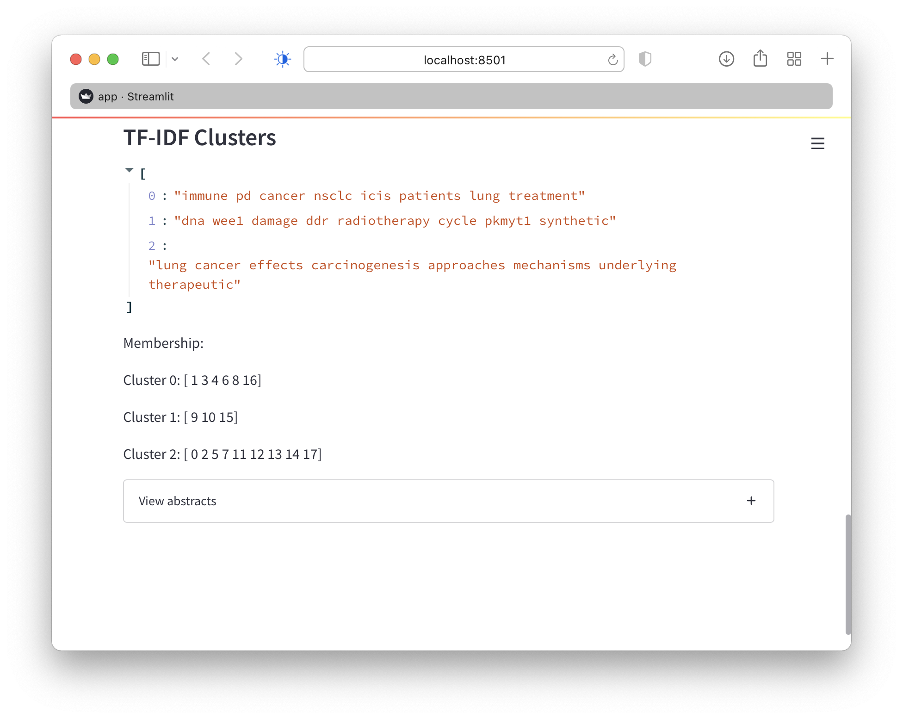

# Simple app clustering abstracts

For a sample of 18 medical abstracts, find clusters (topics) with SVD, NMF, and
TF-IDF

# App

Uses streamlit.io

Preview locally with `make prev`.

Install with `pip install -r requirements.txt`.
